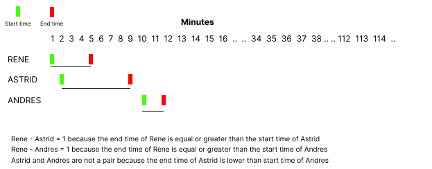
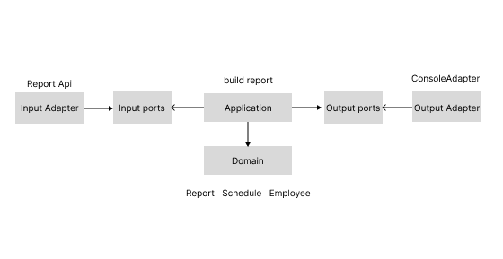

# IOET Exercise
## Description
The company ACME offers their employees the flexibility to work the hours they want. But due to some external circumstances they need to know what employees have been at the office within the same time frame

The goal of this exercise is to output a table containing pairs of employees and how often they have coincided in the office.

Input: the name of an employee and the schedule they worked, indicating the time and hours. This should be a .txt file with at least five sets of data. You can include the data from our examples below:

Example 1:

```
INPUT
RENE=MO10:00-12:00,TU10:00-12:00,TH01:00-03:00,SA14:00-18:00,SU20:00- 21:00
ASTRID=MO10:00-12:00,TH12:00-14:00,SU20:00-21:00
ANDRES=MO10:00-12:00,TH12:00-14:00,SU20:00-21:00
```
```
OUTPUT:
ASTRID-RENE: 2
ASTRID-ANDRES: 3
RENE-ANDRES: 2
```
Example 2:

```
INPUT:
RENE=MO10:15-12:00,TU10:00-12:00,TH13:00-13:15,SA14:00-18:00,SU20:00-21:00
ASTRID=MO10:00-12:00,TH12:00-14:00,SU20:00-21:00
```
```
OUTPUT:
RENE-ASTRID: 3
```

## Assumptions
1. The name of each employee is used to identify them uniquely.
2. The time in the schedule of each employee is in the range of 00:00 to 23:59.
3. The file format is like the examples.

## Solution

The proposed exercise gives a file as an input that contains the records of some employees and the schedule they worked. Analyzing the input format, we can see that the work schedule of each employee is formed by the name of the weekday and the start time and end time he worked that day. The process to get the solution can be divided into 3 parts: read, process, and output. Initially, the input is read and transformed into a list of Schedule objects. Each Schedule instance has the attributes start_time_in_minutes and end_time_in_minutes, which are key attributes to get the solution. After that, the process to get the pairs of each employee is as follows.
1. The list is ordered in an ascendant manner considering the start_time_in_minutes attribute. 
2. The first object is compared with the others in the list. The conditions to meet to know if the object coincided in the schedule with another are: the end_time_in_minutes of the first object has to be equal or greater than the start_time of another and the day has to be the same. This process is iterated with the remaining objects in the list, only in one direction. I mean, the second object is compared with the object going forward in the list, but not with the first element because they were already compared, and so on. To get a better understanding of this process, we can see the image attached below.
3. If an object matches with another, then they are stored in an in-memory structure.



The result is transformed into a human-readable output to print in the console. A Report object is created to save the output with additional information (version, name, etc)

## About the project
The project was built using **screaming architecture** to structure the files and folders and place the domain (got from the problem description) in the center of the project. This design is domain-driven to make it easier to understand and easy to navigate. The development of the project was test-driven (TDD), I mean, the tests were developed first to specify and validate the code written. Furthermore, the project implements a **hexagonal architecture** (ports and adapters pattern), which helps the project keep the domain in the center of the application and protects it from the external world (tools, technologies, etc). The image below show an overview of the project architecture. 



## How to run locally
You need to have docker (tested with the version 20.10.21) and docker compose installed in your computer. Then, clone the project and run the command `docker compose build` and `docker compose run ioet_project`. You need to place the input file in the `files` folder because this folder is binding with the container. When the prompt shows the menu, select `1` and enter the filename like `files/<filename>`. Remember that you need to be in the project root directory. 
